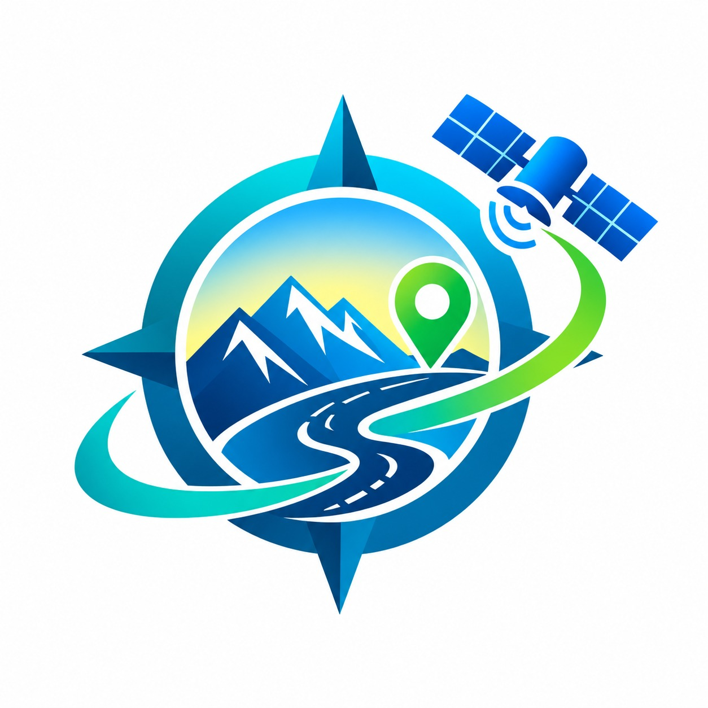

🛰️ ORION  
Operational Regional Intelligence and Optimization Network

AI-Assisted Smart Logistics & Resilience Intelligence Platform

  

 <b>Navigate Smarter • Operate Safer • Stay Resilient</b> 

  
  
  
  
  
  
  

## 🌐 What is ORION?

ORION (Operational Regional Intelligence and Optimization Network) is an AI-assisted smart logistics and resilience intelligence platform designed to help logistics stakeholders monitor fleets, manage shipments, visualize routes, identify operational risks, and make informed transportation decisions.

Unlike conventional navigation systems that primarily answer:

> "How do I get from A to B?"

ORION focuses on:

> "Which transportation decision is safer and more operationally reliable?"

It combines geospatial intelligence, fleet management, shipment tracking, environmental conditions, risk analysis, real-time monitoring, and offline capabilities into one unified platform.

## 🏁 Conclusion

ORION — **Operational Regional Intelligence and Optimization Network** represents a shift from traditional navigation to logistics decision intelligence.

The platform brings together:

🗺️ Geospatial Intelligence  
🚚 Fleet Intelligence  
📦 Shipment Intelligence  
⚠️ Risk Intelligence  
📡 Offline Resilience  
👥 Role-Based Operations

into a single platform.

The fundamental idea behind ORION is:

> Don't just find a route. Understand the risk behind the route.

By combining real-time operational data, maps, risk analysis, fleet visibility, shipment management, and offline capabilities, ORION provides the foundation for safer, smarter, and more resilient logistics operations.

🛰️ **ORION**

**Operational Regional Intelligence and Optimization Network**

Navigate Smarter. Operate Safer. Stay Resilient.

PROTOTYPE DEMO LINK : https://orion-nav.vercel.app/login

